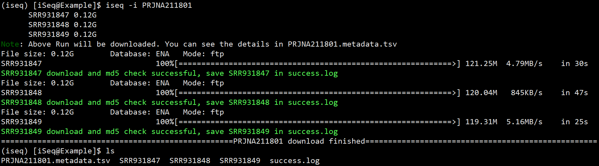
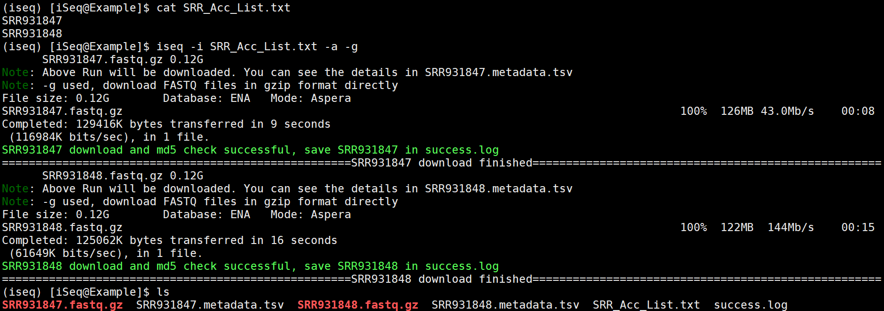

[](https://anaconda.org/bioconda/iseq)
[](https://anaconda.org/bioconda/iseq)
[](https://anaconda.org/bioconda/iseq)
[](https://anaconda.org/bioconda/iseq)
[](https://anaconda.org/bioconda/iseq)

# [iSeq](https://github.com/BioOmics/iSeq): An [i](https://github.com/BioOmics/iSeq)ntegrated tool to fetch public [Seq](https://github.com/BioOmics/iSeq)uencing data
**Cite us**: Haoyu Chao, Zhuojin Li, Dijun Chen, Ming Chen, iSeq: An integrated tool to fetch public sequencing data, ***Bioinformatics***, 2024, btae641, https://doi.org/10.1093/bioinformatics/btae641
## Description

**iSeq** is a Bash script that allows you to download sequencing data and metadata from **[GSA](https://ngdc.cncb.ac.cn/gsa/)**, **[SRA](https://www.ncbi.nlm.nih.gov/sra/)**, **[ENA](https://www.ebi.ac.uk/ena/)**, and **[DDBJ](https://www.ddbj.nig.ac.jp/)** databases. See [Detail Pipeline](https://github.com/BioOmics/iSeq/blob/main/docs/img/iSeq-Pipeline-Detail.png) for iSeq. Here is the basic pipeline of iSeq: 


> [!IMPORTANT]
> To use iSeq, Your system must be **connected to the network** and **support FTP, HTTP, and HTTPS protocols**.

## Update Notes:

### 2025.06.16
- When using `-e`, `--merge`, create symbolic links or retain the original Run files to avoid re-downloading them after merging.  
- Fixed the issue mentioned in [#40](https://github.com/BioOmics/iSeq/issues/40): modified the behavior so that batch downloads do not terminate upon encountering an error, and instead continue until all items are processed.  
- Added an error message when download failures occur, such as `Download failures detected, please check fail.log for details.`  
- Fixed a bug where incomplete downloads from GSA were incorrectly reported as successful.

### 2025.05.23
- Fixed the issue mentioned in [#39](https://github.com/BioOmics/iSeq/issues/39). The problem was that using both `-d sra` and `-g` together would skip the MD5 check in `vdb-validate`.
- **New `-k`, `--skip-md5` option**: Added this option to disable MD5 checks.


<details>
<summary>More Updates</summary>

### 2025.04.25
- Fixed a bug that occurred when re-downloading with empty metadata.  
- Fixed a bug where the while loop exited abnormally with a non-zero exit code.  

### 2025.04.22
- Fixed the issue mentioned in [#33](https://github.com/BioOmics/iSeq/issues/33). `-s`, `--speed` re-enable use.
- Fix the exception when the metadata file is empty, mentioned in [#34](https://github.com/BioOmics/iSeq/issues/34)
- Bug fix to resolve the issue of MD5 checksum failure when downloading ONT or HiFi third-generation sequencing gzip data.

### 2025.04.02
- Fixed the issue mentioned in [#27](https://github.com/BioOmics/iSeq/issues/27) and [Rednote](http://xhslink.com/a/A0TnUnKlvVg9): In `sra-tools` > 3.0.0, running `vdb-validate` without specifying the SRA file path causes it to re-download the file, leading to a stuck process. Specifying the path (e.g., `vdb-validate ./SRR931847`) resolves the issue.

### 2025.03.14
- Fixed the issue mentioned in [#26](https://github.com/BioOmics/iSeq/issues/26#issuecomment-2721427208). The cause was that the data was `paired-end` but had only `one link`, such as `SRR23680070`.

### 2025.03.11
- Input file can contain accessions from different databases.
- `-p` and `-a` can be used simultaneously , with `-a` taking priority.
- Fixed some bugs when retrying download data from GSA.
	
### 2024.12.26
- Fixed the bugs mentioned in [#16](https://github.com/BioOmics/iSeq/issues/16), [#17](https://github.com/BioOmics/iSeq/issues/17) (2024.12.16) and https://github.com/BioOmics/iSeq/issues/19 (2024.12.26).

### 2024.11.21
-  **Dependency update for aspera-cli**:
The version requirement for aspera-cli has been updated from `aspera-cli` to `aspera-cli=4.14.0`.

### 2024.10.23
- **New `-s`, `--speed` option** to set the download speed limit (MB/s) (default: 1000 MB/s). Such as `iseq -i SRR7706354 -s 10`
-  **Dependency update for sra-tools**:
The version requirement for sra-tools has been updated from `sra-tools=2.11` to `sra-tools>=2.11.0`.


### 2024.09.14
-  **New `-e` option for merging FASTQ files**:
Added a `-e` option to merge multiple FASTQ files into a single file for each `Experiment (-e ex)`, `Sample (-e sa)`, or `Study (-e st)`.

-  **New `-i` option for input**:
`iSeq` can now accept a `file` containing multiple accession numbers as input by `-i fileName`.

-  **API change for GSA metadata download**:
The API endpoint has been updated from `getRunInfo` to `getRunInfoByCra` for downloading GSA metadata.


	
-  **Save result to personal directory**:
The output results will now be saved in the user's personal directory by `-o` option.

-  **Updated regex for SAMC matching**:
The matching pattern for SAMC has been changed from `SAMC[A-Z]?[0-9]+` to `SAMC[0-9]+`.

- **Fix some bugs**

</details>


## Features
-  **Multiple Database Support**: Supports multiple bioinformatics databases (GSA/SRA/ENA/DDBJ/GEO).
-  **Multiple Input Formats**: Supports multiple accessions (Project, Study, Sample, Experiment, or Run accession).
-  **Metadata Download**: Supports download sample metadata for each accession.
<details>
<summary>More features</summary>
	
-  **File Format Selection**: Users can choose to directly download gzip-formatted FASTQ files or download SRA files and convert them to FASTQ format.
-  **Multi-threading Support**: Supports the use of multi-threading to accelerate the conversion of SRA to FASTQ files or the compression of FASTQ files.
-  **File Merging**: For experiment-level accession, the script can merge multiple FASTQ files into one.
-  **Parallel Download**: Supports parallel download connections, allowing the specification of the number of connections to speed up download speeds.
-  **Support for Aspera High-speed Download**: For GSA/ENA databases, the script supports high-speed data transfer using Aspera.
-  **Automatic Retry Mechanism**: If a download or verification fails, the script will automatically retry until a set number of attempts have been reached.
-  **Automated File Verification**: After the download is complete, the script will automatically verify the integrity of the files, including checking file sizes and MD5 checksums.
-  **Error Handling**: The script provides error messages and suggestions for solutions when encountering errors.
</details>

## Installation

### 1. **iSeq** can be installed by conda easily
```{bash}
conda install bioconda::iseq
```
- If conda Found conflicts! You can try `conda install -c conda-forge -c bioconda iseq`

### 2. The latest version of iSeq can also be installed from source, see [INSTALL](https://github.com/BioOmics/iSeq/blob/main/INSTALL.md)
```{bash}
# Use the following command to check whether dependent software is installed
iseq --version
```
## Example ([See more](https://github.com/BioOmics/iSeq/blob/main/docs/Examples.md))

1. Download all Run sequencing data and metadata associated with an accession.

```
iseq -i PRJNA211801
```



2. Batch download by Aspera with `-a` to directly download gzip-formatted FASTQ files with `-g`.

```bash
iseq -i SRR_Acc_List.txt -a -g
```




## Usage  ([中文教程](https://github.com/BioOmics/iSeq/blob/main/docs/ChineseTutorial.md)✨)

```{bash}
$ iseq --help

Usage:
  iseq -i accession [options]

Required option:
  -i, --input     [text|file]   Single accession or a file containing multiple accessions.
                                Note: Only one accession per line in the file

Optional options:
  -m, --metadata                Skip the sequencing data downloads and only fetch the metadata for the accession.
  -g, --gzip                    Download FASTQ files in gzip format directly (*.fastq.gz).
                                Note: if *.fastq.gz files are not available, SRA files will be downloaded and converted to *.fastq.gz files.
  -q, --fastq                   Convert SRA files to FASTQ format.
  -t, --threads   int           The number of threads to use for converting SRA to FASTQ files or compressing FASTQ files (default: 8).
  -e, --merge     [ex|sa|st]    Merge multiple fastq files into one fastq file for each Experiment, Sample or Study.
  -d, --database  [ena|sra]     Specify the database to download SRA sequencing data (default: ena).
                                Note: new SRA files may not be available in the ENA database, even if you specify "ena".
  -p, --parallel  int           Download sequencing data in parallel, the number of connections needs to be specified, such as -p 10.
                                Note: breakpoint continuation cannot be shared between different numbers of connections.
  -a, --aspera                  Use Aspera to download sequencing data, only support GSA/ENA database.
  -s, --speed     int           Download speed limit (MB/s) (default: 1000 MB/s).
  -k, --skip-md5                Skip the md5 check for the downloaded files.
  -o, --output    text          The output directory. If not exists, it will be created (default: current directory).
  -h, --help                    Show the help information.
  -v, --version                 Show the script version.
```

### 1. `-i`, `--input`

Input the accession you want to download, You also can input a file containing multiple accessions (Only one accession per line in the file).

```bash
iseq -i PRJNA211801
```
Firstly, **iSeq** will retrieve the metadata of the accession, then proceed to download each Run contained within. 

Currently **supports 6 accession formats** from the following **5 databases**, with supported accession prefixes as follows:

| Databases | BioProject | Study | BioSample | Sample | Experiment | Run  |
| --------- | ---------- | ----- | --------- | ------ | ---------- | ---- |
| **GSA**   | PRJC       | CRA   | SAMC      | \      | CRX        | CRR  |
| **SRA**   | PRJNA      | SRP   | SAMN      | SRS    | SRX        | SRR  |
| **ENA**   | PRJEB      | ERP   | SAME      | ERS    | ERX        | ERR  |
| **DDBJ**  | PRJDB      | DRP   | SAMD      | DRS    | DRX        | DRR  |
| **GEO**   | GSE        | \     | GSM       | \      | \          | \    |

Additionally, for the two data formats (`GSE/GSM`) from the GEO database, it will directly retrieve the associated `PRJNA/SAMN`, then proceed to obtain the contained Runs and download the sequencing data. Therefore, essentially, it still downloads sequencing data from the SRA database.

Here are some examples:

| Accession Type | Prefixes                       | Example                                                     |
| -------------- | ------------------------------ | ----------------------------------------------------------- |
| BioProject     | PRJEB, PRJNA, PRJDB, PRJC, GSE | PRJEB42779, PRJNA480016, PRJDB14838, PRJCA000613, GSE122139 |
| Study          | ERP, DRP, SRP, CRA             | ERP126685, DRP009283, SRP158268, CRA000553                  |
| BioSample      | SAMD, SAME, SAMN, SAMC         | SAMD00258402, SAMEA7997453, SAMN06479985, SAMC017083        |
| Sample         | ERS, DRS, SRS, GSM             | ERS5684710, DRS259711, SRS2024210, GSM7417667               |
| Experiment     | ERX, DRX, SRX, CRX             | ERX5050800, DRX406443, SRX4563689, CRX020217                |
| Run            | ERR, DRR, SRR, CRR             | ERR5260405, DRR421224, SRR7706354, CRR311377                |

In summary, regardless of the data format of your accession among the six options, it will eventually download and **check the MD5 value** of each contained Run. If the MD5 value does not match that in the public database, it will attempt a maximum of **three rounds** of re-downloading. If successful after three attempts of downloading and verification, the file name will be stored in `success.log`; otherwise, if the download fails, the file name will be stored in `fail.log`.

### 2. `-m`, `--metadata `

Download only the sample information of the accession and skip the download of sequencing data.

```bash
iseq -i PRJNA211801 -m
iseq -i CRR343031 -m
```
Therefore, regardless of whether the `-m` parameter is used or not, the sample information of the accession will be obtained. If metadata cannot be retrieved, the **iSeq** program will exit without proceeding to the subsequent download.

> [!NOTE]
> **Note 1**: If the retrieved accession is in the **SRA/ENA/DDBJ/GEO** databases, **iSeq** will first search in the ENA database. If sample information can be retrieved, it will download metadata in **`TSV` format** via the [ENA API](https://www.ebi.ac.uk/ena/portal/api/swagger-ui/index.html), typically containing 191 columns. However, some recently released data in the SRA database may not be promptly synchronized to the ENA database. Therefore, if metadata cannot be obtained from the ENA database, **iSeq** will directly download metadata in **`CSV` format** via the [SRA Database Backend](https://trace.ncbi.nlm.nih.gov/Traces/sra-db-be/), typically containing 30 columns. To maintain consistency with the TSV format, it will be converted to TSV format using `sed -i 's/,/\t/g'`. However, if a single field contains a comma, it may cause column disorder. Ultimately, you will obtain sample information named **`${accession}.metadata.tsv`**.

> [!NOTE]
> **Note 2**: If the retrieved accession is in the **GSA** database, **iSeq** will obtain sample information via GSA's [getRunInfo](https://ngdc.cncb.ac.cn/gsa/search/getRunInfo) interface, downloading metadata in **`CSV` format**, typically containing 25 columns. The metadata obtained above will be saved as `${accession}.metadata.csv`. To supplement more detailed metadata information, iSeq will automatically obtain metadata information for the Project to which the accession belongs via GSA's [exportExcelFile](https://ngdc.cncb.ac.cn/gsa/file/exportExcelFile) interface, downloading metadata in **`XLSX`** format, typically with 3 sheets: `Sample`, `Experiment`, `Run`. The final metadata information will be saved as `${accession}.metadata.xlsx`. In summary, you will ultimately obtain sample information named **`${accession}.metadata.csv`** and **`CRA*.metadata.xlsx`**.

### 3. `-g`, `--gzip`

Directly download FASTQ files in **gzip format**. If direct download is not possible, SRA files will be downloaded and converted to gzip format using multi-threading for decomposition and compression.

```bash
iseq -i SRR1178105 -g
```
Since the majority of data formats stored directly in the **GSA** database are in gzip format, if the accession being searched for is from the GSA database, whether the `-g` parameter is used or not, you can directly download FASTQ files in gzip format. 

If the accession is from the **SRA/ENA/DDBJ/GEO** databases, **iSeq** will first attempt to access the ENA database. If it can directly download FASTQ files in gzip format, it will do so; otherwise, it will download SRA files and convert them to FASTQ format using the `fasterq-dump` tool, then compress the FASTQ files using the `pigz` tool, ultimately obtaining FASTQ files in gzip format.

> [!TIP]
> [parallel-fastq-dump](https://github.com/rvalieris/parallel-fastq-dump) can also convert SRA to gzip-compressed FASTQ files, typically **2-3 times** faster than `fasterq-dump + pigz`. However, considering **IO limitations**, `iSeq` currently does not support `parallel-fastq-dump`.

### 4. `-q`, `--fastq`

After downloading the SRA files, they will be decomposed into multiple **uncompressed FASTQ** files.

```bash
iseq -i SRR1178105 -q
```
This parameter is only effective when the accession is from the **SRA/ENA/DDBJ/GEO** databases and the downloaded files are **SRA files**. After downloading the SRA files, **iSeq** will use the `fasterq-dump` tool to convert them into FASTQ files. Additionally, you can specify the number of threads for conversion using the `-t` parameter.

> [!NOTE]
> **Note1**: `-q` is particularly useful for downloading **single-cell data**, especially for scATAC-Seq data, as it can effectively decompose the files into four parts: `I1`, `R1`, `R2`, `R3`. However, if FASTQ files are directly downloaded via the `-g` parameter, only `R1` and `R3` files will be obtained (e.g., [SRR13450125](https://www.ebi.ac.uk/ena/browser/view/SRR13450125)), which may cause issues during subsequent data analysis.

> [!NOTE]
> **Note 2**: When `-q` and `-g` are used together, the SRA file will first be downloaded, then converted to `FASTQ` files using the `fasterq-dump` tool, and finally compressed into gzip format using `pigz`. It does not directly download `FASTQ` files in gzip format, which is very useful for obtaining comprehensive single-cell data.

### 5. `-t`, `--threads`

Specifies the number of threads to use for decompressing SRA files into FASTQ files or compressing FASTQ files. The default value is `8`.

```bash
iseq -i SRR1178105 -q -t 10
```
Considering that sequencing data files are generally large, you can specify the number of threads for decomposition using the `-t` parameter. However, more threads does not necessarily mean better performance because excessive threads can lead to **high CPU or IO loads**, especially since `fasterq-dump` consumes a considerable amount of IO, potentially impacting the execution of other tasks. Based on the [benchmark evaluation](https://github.com/BioOmics/iSeq/blob/main/docs/img/benchmark.png), we recommend a maximum thread count of 15.

### 6. `-e`, `--merge`

Merge **multiple FASTQ** files into **one FASTQ** file for each Experiment (`ex`), Sample (`sa`) or Study (`st`) .

```bash
iseq -i SRX003906 -g -e ex
```
Although in most cases, an Experiment contains only one Run, some sequencing data may have multiple Runs within an Experiment (e.g., [SRX003906](https://www.ebi.ac.uk/ena/browser/view/SRX003906), [CRX020217](https://ngdc.cncb.ac.cn/gsa/search?searchTerm=CRX020217)). Hence, you can use the `-e` parameter to merge multiple FASTQ files from an Experiment into one. Considering paired-end sequencing, where `fastq_1` and `fastq_2` files need to be merged simultaneously and the sequence names in corresponding lines need to remain consistent, **iSeq** will merge multiple FASTQ files in the **same order**. Ultimately, for **single-end** sequencing data, a single file **`SRX*.fastq.gz`** will be generated, and for **paired-end** sequencing data, two files **`SRX*_1.fastq.gz`** and **`SRX*_2.fastq.gz`** will be generated.

> [!NOTE]
> **Note 1**: If the accession is a **Run ID**, the `-e` parameter cannot be used (see below). Currently, **iSeq** supports merging **both gzip-compressed and uncompressed FASTQ** files, but does not support merging files such as **BAM files and tar.gz** files.
- `-e ex`: merge all fastq files of the same **Experiment** into one fastq file. Accepted accession format: `ERX, DRX, SRX, CRX`.
- `-e sa`: merge all fastq files of the same **Sample** into one fastq file. Accepted accession format: `ERS, DRS, SRS, SAMC, GSM`.
- `-e st`: merge all fastq files of the same **Study** into one fastq file. Accepted accession format: `ERP, DRP, SRP, CRA`.

> [!NOTE]
> **Note 2**: Normally, when an Experiment contains only one Run, identical Runs should have the **same prefix**. For example, `SRR52991314_1.fq.gz` and `SRR52991314_2.fq.gz` have the same prefix `SRR52991314`. In this case, **iSeq** will directly **rename** them to **`SRX*_1.fastq.gz`** and **`SRX*_2.fastq.gz`**. However, there are exceptions, such as in [CRX006713](https://ngdc.cncb.ac.cn/gsa/search?searchTerm=CRX006713) where a Run `CRR007192` contains files with different prefixes. In such cases, **iSeq** will **rename** them as **`SRX*_original_filename`**, for example, they will be renamed as `CRX006713_CRD015671.gz` and `CRX006713_CRD015672.gz`.

### 7. `-d`, `--database`

Specifies the database for downloading SRA files, supporting **ENA** and **SRA** databases.

```bash
iseq -i SRR1178105 -d sra 
```
By default, **iSeq** will automatically detect available databases, so specifying the `-d` parameter is **usually unnecessary**. However, some SRA files may download **slowly** from the ENA database. In such cases, you can force downloading from the SRA database by specifying `-d sra`.

> [!NOTE]
> **Note**: If the corresponding SRA file is not found in the **ENA** database, even if the `-d ena` parameter is specified, **iSeq** will still automatically switch to downloading from the **SRA** database.

### 8. `-p`, `--parallel`

Enables **multi-threaded downloading** and requires specifying the number of threads.

```bash
iseq -i PRJNA211801 -p 10
```
Considering that `wget` may be slow in some cases, you can use the `-p` parameter to let **iSeq** utilize the `axel` tool for multi-threaded downloading.

> [!NOTE]
> **Note 1**: The **resumable download** feature of multi-threaded downloading is only effective within the **same thread**. That is, if the `-p 10` parameter is used for the first download, it must also be used for the second download to enable resumable download.

> [!NOTE]
> **Note 2**: As mentioned, **iSeq** will maintain 10 connections throughout the download process. Therefore, you will see multiple occurrences of the same `Connection * finished` popping up during the download process. This is because some connections are released immediately after completing the download and then new connections are established for downloading.

### 9. `-a`, `--aspera`

Use Aspera for downloading.

```bash
iseq -i PRJNA211801 -a -g
```
As Aspera offers faster download speeds, you can use the `-a` parameter to instruct **iSeq** to use the `ascp` tool for downloading. Unfortunately, Aspera downloading is currently **only supported by the GSA and ENA databases**. The **NCBI SRA** database cannot utilize Aspera for downloading as it predominantly employs Google Cloud and AWS Cloud technologies and other reasons, see [Avoid-using-ascp](https://github.com/ncbi/sra-tools/wiki/Avoid-using-ascp-directly-for-downloads).

> [!NOTE]
> **Note 1**: When accessing the **GSA** database, if download links from **Huawei Cloud** are available, **iSeq** will prioritize downloading through Huawei Cloud, even if the `-a` parameter is used. This is because Huawei Cloud offers faster and more stable download speeds. Therefore, when downloading GSA data, it's **recommended to use the `-a` paramete**r. This way, if access to Huawei Cloud is unavailable, downloading through the Aspera channel is still relatively fast. Otherwise, you'll have to resort to downloading via `wget` or `axel`, which are slower methods.

> [!NOTE]
> **Note 2**: Since `Asper`a requires a key file, **iSeq** will **automatically search for the key** file in the `conda` environment or the `~/.aspera` directory. If the key file is not found, downloading will not be possible.

### 10. `-o`, `--output`

The output directory. If not exists, it will be created (default: current directory).

### 11. `-s`, `--speed`

Download speed limit (MB/s) (default: 1000 MB/s) for `Wget`, `AXEL` and `Aspera`.

### 12 `-k`, `--skip-md5`

Starting from v1.9.2, you can choose to skip the MD5 file integrity check. If you want to perform the MD5 check again after skipping it, simply remove the `-k` parameter and run the same command.

## Output

- If the query accession in **SRA/ENA/DDBJ/GEO** database, the following files will be generated:

| Output        | Description                                                  |
| ------------- | ------------------------------------------------------------ |
| SRA files     | Can be converted to FASTQ files using `-q` option            |
| .metadata.tsv | Metadata for query accession                                 |
| success.log   | Save the SRA file name that has been downloaded successfully |
| fail.log      | Save the SRA file name that has been downloaded failed       |

- If the query accession in **GSA** database, the following files will be generated:

| Output         | Description                                                  |
| -------------- | ------------------------------------------------------------ |
| GSA files      | Mostly in *.gz format, and a few are bam/tar/bz2 format      |
| .metadata.csv  | Metadata for query accession                                 |
| .metadata.xlsx | Metadata for Project including query accession in xlsx format |
| success.log    | Save the GSA file name that has been downloaded successfully |
| fail.log       | Save the GSA file name that has been downloaded failed       |


## Inspired 

**iSeq** was inspired by **[fastq-dl](https://github.com/rpetit3/fastq-dl), [fetchngs](https://github.com/nf-core/fetchngs), [pysradb](https://github.com/saketkc/pysradb), [Kingfisher](https://github.com/wwood/kingfisher-download)**. These excellent tools may also be very helpful. Below are multiple comparisons of different software: 

| Software name                                                | Program languages | Supported databases      | Supported accessions     | Supported formats        | Supported methods       | Fetch metadata | MD5 check | Resumable download | Parallel  download | Merge FASTQ | Skip downloaded | Conda installable | URL                                                 |
| ------------------------------------------------------------ | ----------------- | ------------------------ | ------------------------ | ------------------------ | ---------------------- | -------------- | --------- | ------------------ | ------------------ | ----------- | --------------- | ----------------- | --------------------------------------------------- |
| **iSeq**                                                     | Shell             | GSA, SRA, ENA, DDBJ, GEO | All                      | fq, fq.gz, sra, bam      | wget,  axel, aspera    | ✔              | ✔         | ✔                  | ✔                  | ✔           | ✔               | ✔                 | [🔗](https://github.com/BioOmics/iSeq)               |
| [edgeturbo](https://ngdc.cncb.ac.cn/ettrans/download/)       | C                 | GSA                      | All denied               | fq, fq.gz, bam           | edgeturbo download     | ❌              | ❌         | ✔                  | ❌                  | ❌           | ❌               | ❌                 | [🔗](https://ngdc.cncb.ac.cn/ettrans/download/)      |
| [SRA Toolkit](https://github.com/ncbi/sra-tools)             | C                 | SRA, ENA, DDBJ           | All denied expect Run ID | fq, fq.gz, sra           | prefetch               | ❌              | ✔         | ✔                  | ❌                  | ❌           | ✔               | ✔                 | [🔗](https://github.com/ncbi/sra-tools)              |
| [enaBrowserTools](https://github.com/enasequence/enaBrowserTools) | Python            | SRA, ENA, DDBJ           | All except GSA/GEO ID    | fq, fq.gz, sra           | urllib, aspera         | ✔              | ✔         | ✔                  | ❌                  | ❌           | ✔               | ✔                 | [🔗](https://github.com/enasequence/enaBrowserTools) |
| [fastq-dl](https://github.com/rpetit3/fastq-dl)              | Python            | SRA, ENA, DDBJ           | All except GSA/GEO ID    | fq, fq.gz, sra, sra.lite | wget                   | ✔              | ✔         | ❌                  | ❌                  | ✔           | ✔               | ✔                 | [🔗](https://github.com/rpetit3/fastq-dl)            |
| [fetchngs](https://github.com/nf-core/fetchngs)              | Python            | SRA, ENA, DDBJ, GEO      | All except GSA ID        | fq, fq.gz                | wget, aspera, prefetch | ✔              | ✔         | ✔                  | ❌                  | ❌           | ✔               | ❌                 | [🔗](https://github.com/nf-core/fetchngs)            |
| [pysradb](https://github.com/saketkc/pysradb)                | Python            | SRA, ENA, DDBJ, GEO      | All except GSA ID        | fq, fq.gz, sra, bam      | requests, aspera       | ✔              | ✔         | ✔                  | ❌                  | ❌           | ✔               | ✔                 | [🔗](https://github.com/saketkc/pysradb)             |
| [Kingfisher](https://github.com/wwood/kingfisher-download)   | Python            | SRA, ENA, DDBJ           | All except GSA/GEO ID    | fq, fq.gz, sra           | curl, aria2c, aspera   | ✔              | ✔         | ❌                  | ✔                  | ❌           | ✔               | ✔                 | [🔗](https://github.com/wwood/kingfisher-download)   |
| [ffq](https://github.com/pachterlab/ffq/tree/master)   | Python            | SRA, ENA, DDBJ, GEO           | All except GSA ID    | fq, fq.gz, sra, bam           | requests   | ✔              | ✔         | ❌                  | ❌                  | ❌           | ❌               | ✔                 | [🔗](https://github.com/pachterlab/ffq/tree/master)   |

## Contributing
Contributions to **iSeq** are welcome! If you have any suggestions, bug reports, or feature requests, please open an issue on the project's GitHub repository. If you would like to contribute code, please fork the repository, make your changes, and submit a pull request.

**Cite us**: [https://doi.org/10.1101/2024.05.16.594538](https://doi.org/10.1093/bioinformatics/btae641)

## License
This project is licensed under the [MIT License](LICENSE).
