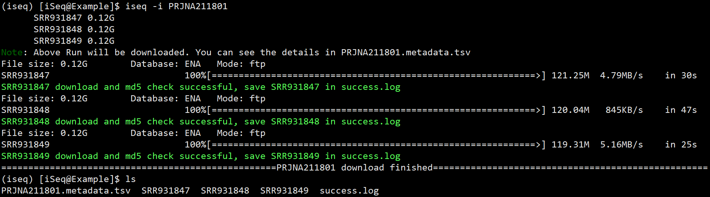
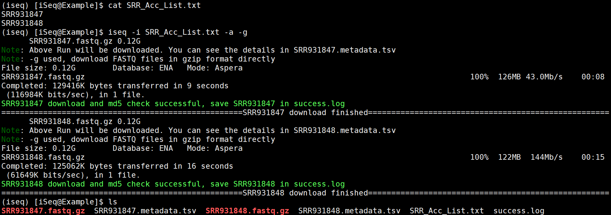

# Examples of using iSeq

## Basic examples
1. Download all Run sequencing data and metadata associated with a Project

   ```
   iseq -i PRJNA211801
   ```

   

   if you run the same code again, iSeq will **skip** downloaded data

   

   ```bash
   iseq -i CRA000553
   ```

   iSeq will prioritize access to the **HUAWEI Cloud** when accessing the **GSA** database.

   

   ```bash
   iseq -i GSE122139
   ```

   If the **MD5 check fails** after the sequencing data is downloaded, iSeq will attempt to re-download up to 3 times. If it still fails, the ID will be stored in the **fail.log file**.

   

2. Download all sequencing data and metadata associated with an Experiment or a BioSample

   ```bash
   iseq -i SRX477044
   iseq -i CRX020217
   iseq -i GSM7417667
   ```

3. Download a single sequencing data and metadata associated with a Run

   ```bash
   iseq -i SRR1178105
   iseq -i CRR311377
   ```

4. Only download metadata information

   ```bash
   iseq -i PRJNA211801 -m
   ```

   

5. Download SRA files and convert them to FASTQ files

   ```bash
   iseq -i SRR1178105 -q
   ```

   

6. Download sequencing data in parallel with 10 connections

   ```bash
   iseq -i SRR1178105 -p 10
   ```

   

7. Download sequencing data by Aspera

   ```bash
   iseq -i SRR1178105 -a
   ```

   

   ```bash
iseq -i CRR311377 -a
   ```
   
   When accessing the GSA database using Aspera, it will still prioritize access to the HUAWEI Cloud. If it is not available, it will proceed with the normal download using Aspera

   

8.  Download gzip-formatted FASTQ files directly

   ```bash
   iseq -i SRR1178105 -g
   ```

   

9.  Merge multiple FASTQ files into one FASTQ file for each Experiment

   ```bash
   iseq -i CRX020217 -e
   ```

   

10. Download sequencing data from SRA database

    ```bash
    iseq -i SRR1178105 -d sra
    ```

    

## Advanced examples

1. Use 10 connections to download SRA files in parallel with `-p 10`, then demultiplex into FASTQ files with the default 8 threads using `-q` and quickly compress with `-g`. Finally, merge Runs from the same Experiment with `-e`.

   ```bash
   iseq -i SRX183509 -q -g -e -p 10
   ```

   

   

2.  Use Aspera with `-a` to directly download gzip-formatted FASTQ files with `-g`, and then merge Runs from the same Experiment. If there is only one Run, rename it with `-e`.

   ```bash
   iseq -i PRJNA211801 -a -g -e
   ```

   

3. Batch download by looping and using Aspera with `-a` to directly download gzip-formatted FASTQ files with `-g`.

   ```bash
   cat SRR_Acc_List.txt | while read Run; do
   	iseq -i $Run -a -g
   done
   ```
   
   


